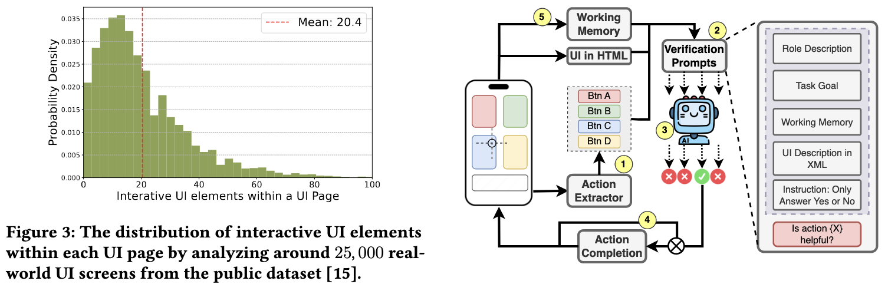

# Awesome GUI Agent
Awesome GUI Agent: a curated list of GUI Agent

# ❤‍🔥News
🤏 [2025-3-23] Working on it.

🤏 [2025-3-20] I will update this repo this weekend.

🤏 [2025-3-10] Fighting.

🤏 [2025-3-8] Happy Women's Day! I'm working hard on revising my survey. I will update the repository soon and provide my paper notes.

🤏 [2025-2-27] Sorry for the delay, Working on it.

🤏 [2025-2-9] Trust me. I promise I will update this repo until the deadline of ACL2025. I will do it.

🤏 [2025-1-20] I promise I will update this repo.

🤏 [2024-11-15] We will release our paper and note soon!

### [GUI Agents List](#agentlist)
| Title & Time | Introduction | Links |
|:--|  :----: | :---:|
| Advancing Mobile GUI Agents: A Verifier-Driven  Approach to Practical Deployment (2025-3) |  | [Github]()   [Paper](https://www.arxiv.org/abs/2503.15937) |
| API Agents vs. GUI Agents: Divergence and Convergence |  | [Github]()   [Paper](https://arxiv.org/abs/2503.11069) |
| AppAgentX: Evolving GUI Agents as Proficient Smartphone Users (2025-3) |  | [Github](https://github.com/Westlake-AGI-Lab/AppAgentX)   [Paper](https://arxiv.org/pdf/2503.02268) |
| Think Twice, Click Once: Enhancing GUI Grounding via Fast and Slow Systems (2025-3) |  | [Github](https://github.com/sugarandgugu/Focus)   [Paper](https://arxiv.org/pdf/2503.06470) |
| UI-TARS: Pioneering Automated GUI Interaction with Native Agents  (2025-2) |  | [Github](https://github.com/bytedance/UI-TARS)   [Paper](https://arxiv.org/abs/2501.12326) |
| Mobile-Agent-E: Self-Evolving Mobile Assistant for Complex Tasks (2025-1) |  | [Github](https://github.com/X-PLUG/MobileAgent/tree/main/Mobile-Agent-E)   [Paper](https://arxiv.org/abs/2501.11733) |
| InfiGUIAgent: A Multimodal Generalist GUI Agent with Native Reasoning and Reflection (2025-1) |  | [Github](https://github.com/Reallm-Labs/InfiGUIAgent)   [Paper](https://arxiv.org/abs/2501.04575) |
| OS-Genesis: Automating GUI Agent Trajectory Construction via  Reverse Task Synthesis (2024-12) |  | [Github](https://github.com/OS-Copilot/OS-Genesis)   [Paper](https://arxiv.org/abs/2412.19723) |
